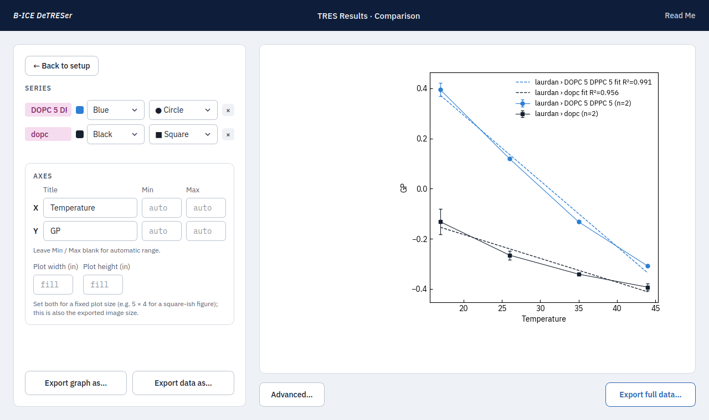
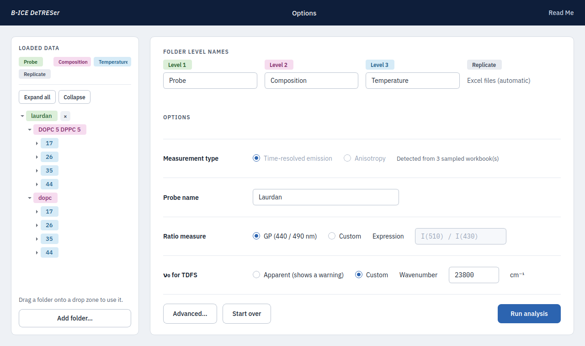
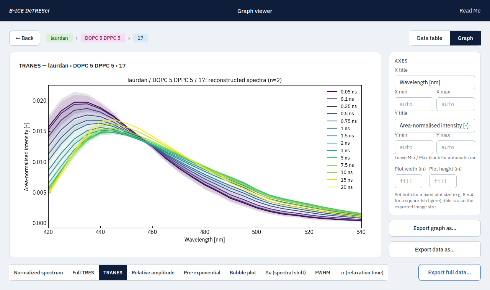
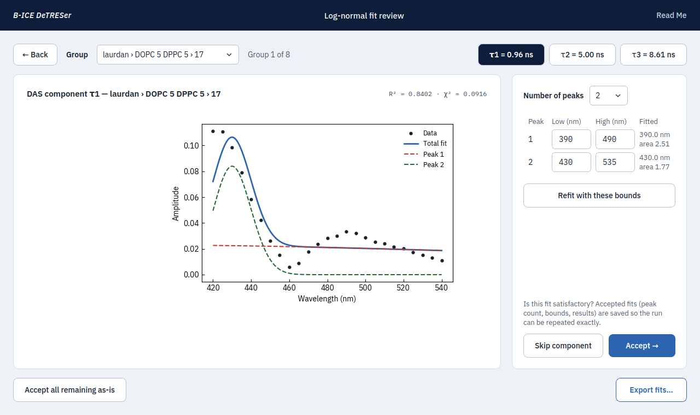

# B-ICE DeTRESer

Desktop analysis of HORIBA DeltaFlex / EzTime time-resolved fluorescence exports: **TRES**, **DAS**, **TDFS**, **Laurdan GP / custom ratios**, and **time-resolved anisotropy** with an optional microviscosity calculation. Built for the B-ICE laboratory (Osaka University) and released so other membrane-biophysics groups can use it.



## What it does

Drop a folder of EzTime workbooks organised as `condition / sub-condition / replicates.xlsx`. DeTRESer averages the replicates, validates that they belong together (same number of fit components, same wavelength grid, same measurement type) and computes, per group:

- reconstructed TRES and area-normalised TRANES, the pseudo steady-state spectrum
- decay-associated spectra (relative amplitude and pre-exponential), DAS peak positions and areas
- time-dependent fluorescence shift: Δν(t), FWHM(t), the relaxation function C(t) and τr, referenced to a literature or apparent ν₀
- Laurdan GP (440/490 nm) or any custom intensity ratio
- anisotropy: r∞, rotational correlation times, and microviscosity from the wobbling-in-cone model with per-group temperature

Results are plotted interactively (single-sample views with optional multi-sample overlays, or comparisons across conditions with SD error bars and linear fits), exported as PNG/SVG/PDF + CSV, and the full run — every table, diagnostic and setting — can be exported so it is reproducible. An optional log-normal deconvolution review splits DAS components into sub-peaks.

| Options | Graph viewer | Fit review |
|---|---|---|
|  |  |  |

## Get it

- **Windows / macOS app:** download the zip for your system from [Releases](../../releases). Windows: unzip, run `B-ICE DeTRESer.exe` inside the folder (SmartScreen → *More info* → *Run anyway* the first time). macOS: right-click the app → *Open* the first time.
- **From source:** Python 3.10+, then `pip install -r requirements-gui.txt` and `python run_detreser.py`. Details in [INSTALL.md](INSTALL.md).

## Documentation

- [User guide](detreser/README.md) — the same text as the program's *Read Me* button: data layout, every option, plots, exports.
- [Methods](tres_suite/docs/methods.md) — equations and conventions of the backend.
- [Validation rules](tres_suite/docs/validation_rules.md) and [output schema](tres_suite/docs/output_schema.md).

## Structure

```
run_detreser.py        launcher
detreser/              PySide6 GUI (no analysis code)
tres_suite/tres_suite/ analysis backend (importable, tested, also a CLI: python -m tres_suite --help)
tres_suite/tests/      backend tests (pytest)
tests_gui/             offscreen end-to-end GUI test
DeTRESer.spec          PyInstaller build file; .github/workflows builds releases automatically
```

## Reporting problems

Open an issue with the group that failed, what you clicked, and `detreser.log` (written next to the program). Anonymised example workbooks that reproduce the problem help enormously.

## Citing

If DeTRESer contributes to a publication, please cite this repository (a Zenodo DOI will be added with the first tagged release).

## Contributions

The analysis backend and all mathematical transformation of the spectra were written by Zachary Nicolella, and validated against the original reference implementation across 250 measurements. The application — GUI implementation, backend integration, in-window graphing, and build pipeline — was produced by Claude Fable 5.1 (Anthropic) and ChatGPT-6 Astra (OpenAI) against a specification written by Zachary Nicolella.

## License

MIT — see [LICENSE](LICENSE). Fonts: IBM Plex, SIL Open Font License.
